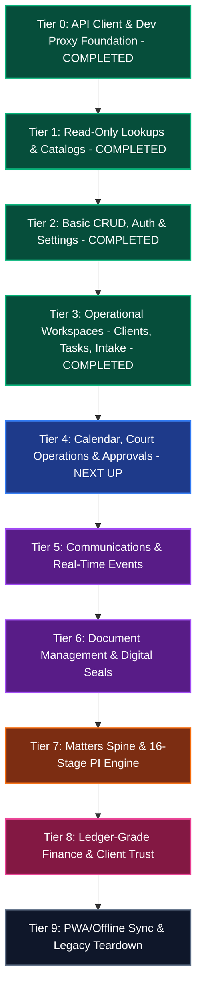

# Backend-to-Frontend Integration Master Plan (Frontend-Centric, Easiest-First)

## User Review Required

> [!IMPORTANT]
> **Port Configuration & Dev Server Collision**:
> Currently, `apps/web/package.json` specifies `"dev": "vite --port=3000"`, while `apps/api` defaults to port 3000 as well (`API_PORT: 3000`).
> For local development, we plan to configure the Vite web app on port **5173** (or 8080) and set up Vite's reverse proxy to forward `/api/v1` and WebSocket calls to `http://localhost:3000` (the NestJS Fastify API). This avoids port collisions and allows cookies (`kka_sid`) to work seamlessly without third-party cookie restrictions.

> [!NOTE]
> **Progressive Hybrid Bridge Pattern**:
> Rather than tearing out `AppContext.tsx` completely in one huge breaking change, we will wire up the backend progressively. As each tier is implemented, its slice inside `AppContext` (or via dedicated hooks like `useDirectory()`) will be wired to the live API with automatic fallbacks for un-migrated slices. Existing UI components will continue to function continuously throughout execution.

## Open Questions

1. **Authentication Mode in Local Development**:
   - Would you like the frontend to default to an automatic developer session (auto-logging in as Senior Partner or Administrator) during initial development, or require the explicit login form right from Tier 2?
2. **Data Query Library**:
   - For server state management, should we introduce `@tanstack/react-query` to manage caching, refetching, and query invalidation cleanly, or use custom lightweight React hooks wrapped around the typed `fetch` client to minimize new dependencies?

---

## 1. Executive Summary & Strategy

The **Kariuki Kagunda & Co. Advocates Lawfirm OS** prototype currently features a high-fidelity interactive React frontend (`apps/web`) backed by a massive 3,700-line mock state container (`AppContext.tsx`) utilizing `localStorage` and static seed data. In parallel, a robust NestJS/Fastify API (`apps/api`) with Prisma 7, PostgreSQL, Redis, and BullMQ has already been architected with 32 dedicated domain modules.

This plan details the **step-by-step, extensive integration of the frontend with the backend**, focusing on the **frontend experience** and ordered **strictly from the easiest, lowest-complexity, read-mostly modules to the most complex transactional and multi-stage workflow engines**.

### Core Refactoring Principles
1. **No "Big Bang" Breakage**: The existing high-fidelity UI will remain fully operational at every step. We introduce an API Client and hybrid adapter pattern so modules can be transitioned one-by-one from `localStorage` to live REST APIs without breaking dependent screens.
2. **Strict Complexity Ordering**: We start with pure, read-only lookup catalogs (Health, Directory, Branches, Roles, Notifications) which have zero interdependencies, then move to basic CRUD (Auth, Search, Settings), then operational hubs (Clients, Tasks, Intake), then temporal/coordination workspaces (Calendar, Court, Approvals), then binary streams (Documents, Stamps), and finally the core 16-stage Personal Injury spine and double-entry finance ledger.
3. **Contract-Driven Type Safety**: Share `@kka/contracts` schemas and DTOs directly across `apps/api` and `apps/web` to eliminate drift between Fastify payload validations and React form states.

---

## 2. Integration Architecture & Foundation (Tier 0)

Before migrating any UI component, the frontend requires its HTTP transport and query foundation.

```
                  ┌──────────────────────────────────────────────┐
                  │                 apps/web                     │
                  │   UI Components (Workspaces, Drawers, Tabs)   │
                  └───────────────────────┬──────────────────────┘
                                          │
                  ┌───────────────────────▼──────────────────────┐
                  │          Hybrid AppContext Bridge            │
                  │ (Routes integrated slices to API hooks while  │
                  │  retaining in-memory fallback during rollout)│
                  └───────────────────────┬──────────────────────┘
                                          │
                  ┌───────────────────────▼──────────────────────┐
                  │      Feature API Hooks (e.g. useDirectory)   │
                  └───────────────────────┬──────────────────────┘
                                          │
                  ┌───────────────────────▼──────────────────────┐
                  │            Core API Client (Fetch)           │
                  │ - Base URL: /api/v1 (Vite Dev Proxy)         │
                  │ - Credentials: 'include' (Cookie Session)    │
                  │ - Zod Schema Validation & Error Normalizer   │
                  └───────────────────────┬──────────────────────┘
                                          │ HTTP / JSON
                                          ▼
                  ┌──────────────────────────────────────────────┐
                  │       apps/api (NestJS + Fastify Engine)     │
                  │  /api/v1/* (Guards, Services, Prisma 7, DB)  │
                  └──────────────────────────────────────────────┘
```

### Proposed Changes for Tier 0
- **Configure Vite Dev Proxy** (`apps/web/vite.config.ts`):
  Proxy `/api/v1` to `http://localhost:3000` (or `process.env.API_PORT`) so all cookies (`kka_sid`) and requests flow naturally without cross-origin CORS session friction.
- **Install / Link Workspace Dependencies** (`apps/web/package.json`):
  Add `"@kka/contracts": "workspace:*"` to `apps/web/package.json` to reuse all Zod schemas directly in frontend forms.
- **Create HTTP Client** (`apps/web/src/lib/api/client.ts`):
  Lightweight, typed HTTP client supporting `get`, `post`, `patch`, `delete`, and `upload` (multipart streaming) with centralized error parsing (`ApiError`) and request correlation IDs.
- **Create Global Connection Indicator** (`apps/web/src/components/common/ConnectionStatusBadge.tsx`):
  Header status pill displaying Live / Local / Degraded mode by pinging `/api/v1/health/live`.

---

## 3. The 9-Tier Integration Roadmap (Easiest to Most Complex)

### Integration Progress Summary

| Tier | Focus Area | Status | Verification Notes |
|---|---|---|---|
| **Tier 0** | API Client & Dev Proxy Foundation | **COMPLETED** | Vite proxy to `http://127.0.0.1:3000`, typed client with cookie credentials, `ConnectionStatusBadge` |
| **Tier 1** | Pure Read-Only Catalogs & Lookups | **COMPLETED** | `/health/live`, `/directory`, `/organization/branches`, `/users`, `/notifications` |
| **Tier 2** | Basic CRUD, Real Auth & Settings | **COMPLETED** | `/auth/login`, `/auth/me`, `/auth/logout`, `/search`, `/settings`, `/integrations/test` |
| **Tier 3** | Operational Workspaces (Clients, Tasks, Intake) | **COMPLETED** | `/clients`, `/tasks`, `/tasks/:id/status`, `/intake` lead capture & conversion |
| **Tier 4** | Calendar, Court Operations & Approvals | **NEXT UP** | `/calendar`, `/court`, `/approvals` |
| **Tier 5** | Communications & Real-Time Events | Roadmap | Message threads, SMS/WhatsApp outbox, Socket.IO live events |
| **Tier 6** | Document Management & Digital Seals | Roadmap | Private VPS storage adapter, versioning, official firm stamps/signatures |
| **Tier 7** | Matters Spine & 16-Stage PI Engine | Roadmap | Authoritative matter lifecycle, stage gates, SLA calculation |
| **Tier 8** | Ledger-Grade Finance & Client Trust | Roadmap | Double-entry trust funds, fee notes, disbursements, statement reconciliation |
| **Tier 9** | PWA/Offline Sync & Legacy Teardown | Roadmap | IndexedDB outbox replay, deprecation of localStorage seed state |



---

### Tier 1: Pure Read-Only Catalogs & Independent Lookups [STATUS: COMPLETED]
*Complexity: 1/5 | Risk: Minimal | Zero business logic interdependencies*

These endpoints only perform HTTP `GET`, have no complex state cascades, and serve reference data consumed throughout the app.

#### 1.1 System Health & Diagnostics
- **Backend Endpoints**: `GET /health/live`, `GET /health/ready`
- **Frontend Target**: `AppShell.tsx` status bar & `SystemOperationsTab.tsx` in Admin.
- **Implementation**:
  - Create hook `useSystemHealth()` polling every 30s.
  - If backend is unresponsive, show subtle warning banner without blocking UI.
- **Deliverables**: Live status indicator in UI shell.

#### 1.2 Third-Party Directory (Read-Only)
- **Backend Endpoints**: `GET /directory?type=&q=`
- **Frontend Target**: `DirectoryWorkspace.tsx` & directory picker modals in Matter workflows.
- **Implementation**:
  - Create `directoryApi.list({ type, q })`.
  - Connect search input and category filter chips directly to API query params.
  - Verify contacts load cleanly into the grid and table views.

#### 1.3 Organization & Branch Directory
- **Backend Endpoints**: `GET /organization`, `GET /organization/branches`
- **Frontend Target**: `AppShell.tsx` branch selector & `BranchesTab.tsx`.
- **Implementation**:
  - Replace static `SEED_BRANCHES` in `AppContext` with `organizationApi.listBranches()`.
  - Ensure the branch switcher in the top navigation populates with live branches (Nairobi HQ, Nakuru Branch).

#### 1.4 User Directory & Role Definitions (Read-Only)
- **Backend Endpoints**: `GET /users`, `GET /organization/roles`, `GET /organization/permissions`
- **Frontend Target**: Assignee dropdowns across Tasks, Matters, Intake, and `StaffDirectoryTab.tsx`.
- **Implementation**:
  - Fetch active staff list on app initialization.
  - Populate assignee selects with real staff profiles and avatars.

#### 1.5 System Notifications (Read & Mark Read)
- **Backend Endpoints**: `GET /notifications?unread=true`, `POST /notifications/:id/read`
- **Frontend Target**: `AppShell.tsx` notification bell popover.
- **Implementation**:
  - Replace static `SEED_NOTIFICATIONS` with `notificationsApi.list({ unread: true })`.
  - Wire click handler on each notification to `notificationsApi.markRead(id)`.

---

### Tier 2: Basic CRUD, Real Auth & Admin Configuration [STATUS: COMPLETED]
*Complexity: 2/5 | Risk: Low | Standard REST models, self-contained forms*

#### 2.1 Real Authentication & Session Verification
- **Backend Endpoints**: `POST /auth/login`, `POST /auth/logout`, `GET /auth/me`, `POST /auth/elevate`
- **Frontend Target**: Login Dialog / Screen & User Profile dropdown in `AppShell.tsx`.
- **Implementation**:
  - Replace mock persona switcher with genuine email/password login modal utilizing `LoginSchema`.
  - Fastify sets the `kka_sid` HTTP-only session cookie.
  - On initial page load, `apps/web` calls `GET /auth/me` to hydrate `currentUser` and permission keys.
  - Implement sign-out button calling `POST /auth/logout` and clearing session cache.

#### 2.2 Third-Party Directory Full CRUD
- **Backend Endpoints**: `POST /directory`, `PATCH /directory/:id`
- **Frontend Target**: Add Contact Modal & Edit Drawer in `DirectoryWorkspace.tsx`.
- **Implementation**:
  - Wire "Add Contact" form submitting `name`, `type` (insurer, garage, doctor, court station, process server), phone, email, and county.
  - Refresh directory cache upon successful submission.

#### 2.3 Global Command Palette & Unified Search
- **Backend Endpoints**: `GET /search?q=`
- **Frontend Target**: Global Command Palette (`Cmd+K` / `Ctrl+K`) in `AppShell.tsx`.
- **Implementation**:
  - Connect search input debounce (250ms) to `searchApi.query(q)`.
  - Render categorized results: Matters, Clients, Tasks, Documents with direct navigation links.

#### 2.4 Admin Configuration Studio & Setting Scopes
- **Backend Endpoints**: `GET /settings/definitions`, `POST /settings/resolve/:key`, `POST /settings/:key`
- **Frontend Target**: `AdminWorkspace.tsx` (`FirmProfileTab.tsx`, `NumberingSchemesTab.tsx`, `DocumentPoliciesTab.tsx`).
- **Implementation**:
  - Fetch configuration definitions for firm profile, numbering rules, and document policies.
  - Save overrides to the backend with scope target (`FIRM`, `BRANCH`).

#### 2.5 Truthful Integrations Health & Diagnostic Testing
- **Backend Endpoints**: `GET /integrations`, `POST /integrations/:id/test`
- **Frontend Target**: `IntegrationsWorkspace.tsx`.
- **Implementation**:
  - Remove prototype's fake `setTimeout` simulation.
  - Query live status for Google Workspace, WhatsApp Cloud, Judiciary CTS, M-Pesa Daraja, Africa's Talking SMS.
  - Wire "Test Connection" button to `integrationsApi.test(id)` and display real latency/error diagnostics.

---

### Tier 3: Core Operational Workspaces (Clients, Intake Leads, Tasks) [STATUS: COMPLETED]
*Complexity: 3/5 | Risk: Medium | Relational forms, list-detail navigation, validation rules*

#### 3.1 Clients Workspace (Full Lifecycle)
- **Backend Endpoints**: `GET /clients?q=`, `GET /clients/:id`, `POST /clients`, `PATCH /clients/:id`
- **Frontend Target**: `ClientsWorkspace.tsx`, New Client Modal, and Client Detail Drawer.
- **Implementation**:
  - Create `clientsApi.list(q)` and `clientsApi.create(client)`.
  - Hook client search bar and pagination to backend query parameters.
  - Wire New Client modal with validation against `CreateClientSchema` (ID Number, KRA PIN, Phone).

#### 3.2 Tasks & Deadlines Workspace
- **Backend Endpoints**: `GET /tasks?matterId=&assignedToId=&status=`, `POST /tasks`, `POST /tasks/:id/status`
- **Frontend Target**: `TasksWorkspace.tsx` (Kanban Board & List View), Quick Create Modal.
- **Implementation**:
  - Bind Kanban column state changes (TODO -> IN_PROGRESS -> COMPLETED) to `POST /tasks/:id/status`.
  - Wire task creation modal with assignee, priority, due date, and matter linking.
  - Retain frontend circular-dependency safety check before submitting.

#### 3.3 Client Intake & Lead Pipeline
- **Backend Endpoints**: `GET /intake?disposition=`, `GET /intake/:id`, `POST /intake`, `POST /intake/:id/parties`
- **Frontend Target**: `IntakeWorkflowManager.tsx` (Leads Board, Party Registration).
- **Implementation**:
  - Fetch leads categorized by disposition (`NEW`, `IN_REVIEW`, `CONFLICT_CHECKED`, `ACCEPTED`).
  - Wire new lead capture form (claimant details, incident date/location, practice area).
  - Add associated parties (defendants, insurance companies, policy numbers).

#### 3.4 Conflict Check Engine & KYC Clearance
- **Backend Endpoints**: `POST /intake/:id/conflict-search`, `POST /intake/:id/conflict-clearance`, `POST /intake/:id/kyc`
- **Frontend Target**: Conflict Check Modal & KYC Retainer Drawer in `IntakeWorkflowManager.tsx`.
- **Implementation**:
  - Wire "Run Conflict Check" button to call `intakeApi.runConflictSearch(intakeId)`.
  - Display server-calculated match confidence scores and conflicting matter numbers.
  - If conflicts exist, require partner elevation sign-off notes before clearance.
  - Update KYC checklist (National ID verified, Retainer agreement signed).

---

### Tier 4: Calendar, Court Operations & Approvals [STATUS: NEXT UP]
*Complexity: 3.5/5 | Risk: Medium-High | Temporal coordination, court registry workflows, role gating*

#### 4.1 Temporal Calendar Command Centre
- **Backend Endpoints**: `GET /calendar/events?from=&to=&userId=&matterId=`, `POST /calendar/events`, `POST /calendar/events/:id/reschedule`
- **Frontend Target**: `CalendarWorkspace.tsx` (Agenda, 3-Day, Week, Month views).
- **Implementation**:
  - Query events scoped to current view date range (`from` / `to`) and filter by assignee or matter.
  - Enforce `CalendarEditPolicy` rules: if event policy is `REASON_REQUIRED`, show required justification modal before calling `reschedule(id, reason)`.
  - Connect quick event creator for client consultations, court mentions, and deadlines.

#### 4.2 Court Operations Workspace
- **Backend Endpoints**: `GET /court/dashboard`, `GET /court/proceedings?matterId=`, `POST /court/proceedings`, `POST /court/filings`, `POST /court/service`, `POST /court/service/:id/attempts`
- **Frontend Target**: `CourtOperationsWorkspace.tsx` (Court Diary, CTS Filing Queue, Process Service Tracker).
- **Implementation**:
  - Wire Court Diary tab to `GET /court/dashboard` displaying court attendances by station and judge.
  - Bind CTS Filing Queue to `POST /court/filings` and `PATCH /court/filings/:id`.
  - Wire Service Queue to `POST /court/service/:id/attempts` allowing process servers to record affidavits and service results.

#### 4.3 Approvals Hub & Unified Governance
- **Backend Endpoints**: `GET /approvals?status=`, `POST /approvals/:id/decision`
- **Frontend Target**: `ApprovalsWorkspace.tsx`.
- **Implementation**:
  - Query pending approvals for current user's role (fee waivers, expense disbursements, document sign-offs, stage handoffs).
  - Wire Approve / Reject actions with required comment dialog.

---

### Tier 5: Communications & Real-Time Events (High Complexity)
*Complexity: 4/5 | Risk: Medium | WebSockets / polling, thread synchronization, unread counters*

#### 5.1 Communication Channels & Thread Messaging
- **Backend Endpoints**: `GET /communications/channels`, `GET /communications/channels/:id/messages?before=`, `POST /communications/channels/:id/messages`
- **Frontend Target**: `CommunicationsWorkspace.tsx`.
- **Implementation**:
  - Fetch channel list (matter-specific channels, branch channels, firm broadcast).
  - Render message history with cursor-based pagination (`before` query parameter).
  - Wire message sender with optimistic local echo.
  - Wire "Convert Message to Task" to pre-fill the task creation drawer.

#### 5.2 Live Push Notifications (Socket.IO / WebSockets)
- **Backend Gateway**: NestJS `EventsGateway` (`/socket.io`).
- **Frontend Target**: Global socket listener in `apps/web/src/lib/api/socket.ts`.
- **Implementation**:
  - Connect socket client with session cookie auth.
  - Listen for real-time events: `notification.created`, `task.assigned`, `approval.requested`, `channel.message`.
  - Update unread badge counters without requiring full page refetches.

---

### Tier 6: Document Management, Binary Uploads & Digital Stamping (High Complexity)
*Complexity: 4/5 | Risk: High | Multipart streaming, storage volumes, checksums, PDF stamping*

#### 6.1 Document Explorer & Metadata Management
- **Backend Endpoints**: `GET /documents?matterId=&q=`, `POST /documents`
- **Frontend Target**: `DocumentsWorkspace.tsx` & Documents tab in `MatterDetailWorkspace.tsx`.
- **Implementation**:
  - Query legal documents by matter ID or category (Pleadings, Medical, Evidence, Correspondence).
  - Create document metadata records with confidentiality classification (`STANDARD`, `RESTRICTED`, `PARTNER_ONLY`).

#### 6.2 Multipart Binary Upload & Authorized Stream Downloads
- **Backend Endpoints**: `POST /documents/:id/versions` (Fastify multipart), `GET /documents/versions/:versionId/download`
- **Frontend Target**: Document Upload Modal & Version History Drawer in `DocumentsWorkspace.tsx`.
- **Implementation**:
  - Replace prototype `selectedFileDataUrl` (storing raw strings in localStorage) with a true `FormData` file upload stream.
  - Show upload progress bar.
  - Connect "Download" buttons to stream authorized files directly via authenticated browser endpoints.

#### 6.3 Document Review Lifecycle & Firm Mark Execution
- **Backend Endpoints**: `POST /documents/:id/review`, `POST /documents/:id/review-decision`, `POST /documents/:id/filed`, `POST /marks/apply`
- **Frontend Target**: `DocumentPreviewModal.tsx`, `FirmMarksStampsTab.tsx`.
- **Implementation**:
  - Wire "Submit for Review" modal with reviewer selection and notes.
  - Wire reviewer "Approve / Request Changes" decision dialog.
  - Wire firm seal/stamp placement tool allowing partners to digitally stamp documents with SHA256 audit verification.

---

### Tier 7: Matters Spine & 16-Stage Personal Injury Engine (Very High Complexity)
*Complexity: 4.8/5 | Risk: Critical | Core operational backbone, 16 distinct stage sub-workspaces, validation gates*

#### 7.1 Matters Board, Filtering & Detail Navigation
- **Backend Endpoints**: `GET /matters`, `GET /matters/:id`, `POST /matters`, `PATCH /matters/:id`
- **Frontend Target**: `MattersWorkspace.tsx` (Board & List views) & `MatterDetailWorkspace.tsx`.
- **Implementation**:
  - Load active matters pipeline grouped by stage (Stages 1 through 16).
  - Connect branch, practice area, and stalled-matter filters.
  - Hydrate `MatterDetailWorkspace` with live matter record, client metadata, and supervising advocate.

#### 7.2 Intake-to-Matter Conversion Wizard
- **Backend Endpoints**: `POST /intake/:id/convert`
- **Frontend Target**: Conversion Wizard modal in `IntakeWorkflowManager.tsx`.
- **Implementation**:
  - Select supervising partner, originating branch, court clerk, and initial action.
  - Submit conversion request; navigate directly to newly created matter detail.

#### 7.3 Stage Transition Gatekeeper & Handoff Sign-Off
- **Backend Endpoints**: `GET /matters/:id/stage-validation/:toStage`, `POST /matters/:id/stage-transitions`, `POST /matters/handoffs/:handoffId/acknowledge`
- **Frontend Target**: `StageTransitionModal.tsx` & Handoff Banner in `MatterDetailWorkspace.tsx`.
- **Implementation**:
  - When user drags or advances a matter to the next stage, call `stage-validation/:toStage` to retrieve mandatory gate checklist (e.g., "Police abstract attached", "Medical report obtained").
  - Submit transition with handoff notes, new stage owner, and critical next action.
  - When new owner opens the matter, render an Acknowledgment Banner calling `POST /matters/handoffs/:id/acknowledge`.

#### 7.4 Deep Personal Injury Stage Sub-Workspaces
- **Backend Endpoints**: `GET /personal-injury/:matterId`, `PUT /personal-injury/:matterId/*`
- **Frontend Targets**: Dedicated sub-workspaces imported in `MatterDetailWorkspace.tsx`:
  - **Stages 1-2**: `IncidentEvidenceWorkspace.tsx` -> Wire police OB number, vehicle registry, witness statements.
  - **Stage 3**: `MedicalManagementWorkspace.tsx` -> Wire treatment records, medical report requests, disability %.
  - **Stage 4**: `LiabilityQuantumWorkspace.tsx` -> Wire liability apportionment (claimant % vs defendant %), special damages ledger, and general damages opinion.
  - **Stage 5**: `ClaimNegotiationWorkspace.tsx` -> Wire offer/counter-offer ledger and partner settlement authorization.
  - **Stages 6-8**: `AuthorityToLitigateWorkspace.tsx`, `PleadingsBundleWorkspace.tsx`, `CourtFilingWorkspace.tsx`, `ServiceQueueWorkspace.tsx`.
  - **Stages 9-11**: `DefencePleadingsWorkspace.tsx`, `PreTrialComplianceWorkspace.tsx`, `HearingPreparationWorkspace.tsx`.
  - **Stages 12-14**: `CourtOutcomeWorkspace.tsx`, `SubmissionsWorkspace.tsx`, `JudgmentAwardWorkspace.tsx`.
  - **Stages 15-16**: `RecoveryExecutionWorkspace.tsx`, `SettlementDistributionWorkspace.tsx`, `MatterClosureWizard.tsx`.

---

### Tier 8: Ledger-Grade Finance Workspace (Highest Complexity)
*Complexity: 5/5 | Risk: Critical | Kenyan legal accounting rules, trust money isolation, double-entry immutability*

#### 8.1 Financial Accounts & Real-Time Balance Overview
- **Backend Endpoints**: `GET /finance/accounts`, `GET /finance/accounts/:id/balance`
- **Frontend Target**: Accounts overview cards in `FinanceWorkspace.tsx`.
- **Implementation**:
  - Replace static fake numbers with live account balances from the double-entry database.
  - Display clear separation between **Client Trust Accounts** and **Office Operating Accounts**.

#### 8.2 Expense Requisitions & Multi-Stage Disbursements
- **Backend Endpoints**: `POST /finance/expenses`, `POST /finance/expenses/:id/decision`, `POST /finance/expenses/:id/disburse`
- **Frontend Target**: Requisitions tab in `FinanceWorkspace.tsx`.
- **Implementation**:
  - Advocate submits expense requisition linked to matter and category (court fees, medical expert, transport).
  - Managing partner receives approval alert in Approvals Hub.
  - Finance clerk records disbursement, specifying paying account (Petty Cash or Office Bank).

#### 8.3 Payment Receipts & Trust Funds Deposit
- **Backend Endpoints**: `POST /finance/receipts`
- **Frontend Target**: Record Receipt Modal in `FinanceWorkspace.tsx`.
- **Implementation**:
  - Form capturing payer name, payment method (M-Pesa, EFT, Cheque), reference number, and destination account.
  - Auto-generate compliant Kenyan law firm receipt number.

#### 8.4 Matter Ledger & Double-Entry Journal Postings
- **Backend Endpoints**: `GET /finance/matters/:matterId/ledger`, `POST /finance/journals`, `POST /finance/journals/:id/reverse`
- **Frontend Target**: Matter Ledger tab in `FinanceWorkspace.tsx`.
- **Implementation**:
  - Render immutable debit/credit journal table for the selected matter.
  - Enforce zero frontend balance arithmetic: balances and client trust balances are supplied authoritatively by PostgreSQL.
  - Support journal reversal with mandatory audit reason.

#### 8.5 Fee Notes & Trust Fund Application
- **Backend Endpoints**: Fee Note creation, status updates, and trust fund allocations.
- **Frontend Target**: Fee Notes tab in `FinanceWorkspace.tsx`.
- **Implementation**:
  - Billable time and disbursements rollup into formal Fee Note.
  - "Apply Trust Funds" modal transferring cleared client funds to office revenue account with full journal posting.

---

### Tier 9: Full Production Hardening, Offline Sync & Cleanup
*Complexity: 4/5 | Risk: Low | System hygiene, persistence cleanup*

#### 9.1 Audit Trail Explorer
- **Backend Endpoints**: `GET /audit?matterId=&entityType=&actorUserId=`
- **Frontend Target**: `AuditLogsTab.tsx` in `AdminWorkspace.tsx`.
- **Implementation**:
  - Filter append-only audit events by matter, actor, action type, and date range.

#### 9.2 Real BI Reports & Analytics
- **Backend Endpoints**: `GET /reports/*`
- **Frontend Target**: `ReportsWorkspace.tsx`.
- **Implementation**:
  - Replace mock charts with live matter throughput, fee realization, and stage bottleneck analytics.

#### 9.3 Durable Offline / PWA Support (Dexie.js)
- **Frontend Target**: `apps/web/src/offline/dexieDb.ts` & mutation queue.
- **Implementation**:
  - Replace temporary in-memory `mutationQueue` with indexed IndexedDB storage.
  - Replay pending mutations when connectivity returns; show conflict resolution dialog if entity changed on server.

#### 9.4 Legacy AppContext Decommissioning
- **Frontend Target**: `AppContext.tsx`.
- **Implementation**:
  - Remove deprecated `SEED_*` fixtures and `localStorage.setItem` fallbacks once all modules are natively connected.

---

## 4. Summary of Files to Modify & Create

### Foundation Files (Tier 0)
| Action | File | Description |
|---|---|---|
| **MODIFY** | `apps/web/vite.config.ts` | Add `/api/v1` and WebSocket proxy targeting NestJS backend |
| **MODIFY** | `apps/web/package.json` | Add `@kka/contracts: workspace:*` |
| **NEW** | `apps/web/src/lib/api/client.ts` | Base HTTP client with error handling & auth cookies |
| **NEW** | `apps/web/src/lib/api/types.ts` | Common API request/response wrapper types |
| **NEW** | `apps/web/src/components/common/ConnectionStatusBadge.tsx` | Backend live/offline pill badge |

### Feature API Client Modules (Tiers 1–8)
| Action | File | Description |
|---|---|---|
| **NEW** | `apps/web/src/lib/api/health.api.ts` | Health & system readiness client (Tier 1) |
| **NEW** | `apps/web/src/lib/api/directory.api.ts` | Third-party directory client (Tier 1 & 2) |
| **NEW** | `apps/web/src/lib/api/organization.api.ts` | Branches, roles, permissions client (Tier 1) |
| **NEW** | `apps/web/src/lib/api/users.api.ts` | Staff directory & invites client (Tier 1 & 2) |
| **NEW** | `apps/web/src/lib/api/notifications.api.ts` | Unread notifications & read states (Tier 1) |
| **NEW** | `apps/web/src/lib/api/auth.api.ts` | Login, session verify, elevate, logout (Tier 2) |
| **NEW** | `apps/web/src/lib/api/search.api.ts` | Global command palette search client (Tier 2) |
| **NEW** | `apps/web/src/lib/api/settings.api.ts` | Configuration studio read/write client (Tier 2) |
| **NEW** | `apps/web/src/lib/api/integrations.api.ts` | Live connection health & test triggers (Tier 2) |
| **NEW** | `apps/web/src/lib/api/clients.api.ts` | Client directory & detail CRUD (Tier 3) |
| **NEW** | `apps/web/src/lib/api/tasks.api.ts` | Tasks list & status mutator (Tier 3) |
| **NEW** | `apps/web/src/lib/api/intake.api.ts` | Leads, parties, conflict check & conversion (Tier 3 & 7) |
| **NEW** | `apps/web/src/lib/api/calendar.api.ts` | Event scheduling & rescheduling client (Tier 4) |
| **NEW** | `apps/web/src/lib/api/court.api.ts` | Court proceedings, filings & process service (Tier 4) |
| **NEW** | `apps/web/src/lib/api/approvals.api.ts` | Unified approval decision client (Tier 4) |
| **NEW** | `apps/web/src/lib/api/comms.api.ts` | Channels & thread messages client (Tier 5) |
| **NEW** | `apps/web/src/lib/api/documents.api.ts` | Multipart upload, download stream & reviews (Tier 6) |
| **NEW** | `apps/web/src/lib/api/matters.api.ts` | Matters pipeline, stage transitions, timeline (Tier 7) |
| **NEW** | `apps/web/src/lib/api/personalInjury.api.ts` | 16-stage PI domain endpoints (Tier 7) |
| **NEW** | `apps/web/src/lib/api/finance.api.ts` | Double-entry journals, accounts, expenses, receipts (Tier 8) |

### Existing Workspaces Progressively Connected
| Action | File | Target Tier |
|---|---|---|
| **MODIFY** | `apps/web/src/context/AppContext.tsx` | Progressively delegate slices to API clients |
| **MODIFY** | `apps/web/src/components/layout/AppShell.tsx` | Tiers 0, 1, 2 (Status, Branch, User, Search, Bell) |
| **MODIFY** | `apps/web/src/components/directory/DirectoryWorkspace.tsx` | Tiers 1, 2 (Live contacts & CRUD) |
| **MODIFY** | `apps/web/src/components/integrations/IntegrationsWorkspace.tsx` | Tier 2 (Live connection testing) |
| **MODIFY** | `apps/web/src/components/admin/AdminWorkspace.tsx` | Tiers 1, 2, 9 (Staff, Branches, Settings, Audit) |
| **MODIFY** | `apps/web/src/components/clients/ClientsWorkspace.tsx` | Tier 3 (Live client profiles) |
| **MODIFY** | `apps/web/src/components/tasks/TasksWorkspace.tsx` | Tier 3 (Live task board) |
| **MODIFY** | `apps/web/src/components/intake/IntakeWorkflowManager.tsx` | Tiers 3, 7 (Leads, conflict check, conversion) |
| **MODIFY** | `apps/web/src/components/calendar/CalendarWorkspace.tsx` | Tier 4 (Live events & policy rescheduling) |
| **MODIFY** | `apps/web/src/components/court/CourtOperationsWorkspace.tsx` | Tier 4 (Live court diary & process service) |
| **MODIFY** | `apps/web/src/components/approvals/ApprovalsWorkspace.tsx` | Tier 4 (Live multi-role approvals) |
| **MODIFY** | `apps/web/src/components/comms/CommunicationsWorkspace.tsx` | Tier 5 (Live channels & messaging) |
| **MODIFY** | `apps/web/src/components/documents/DocumentsWorkspace.tsx` | Tier 6 (Live binary upload & download streams) |
| **MODIFY** | `apps/web/src/components/matters/MattersWorkspace.tsx` | Tier 7 (Live 16-stage matter pipeline) |
| **MODIFY** | `apps/web/src/components/matters/MatterDetailWorkspace.tsx` | Tier 7 (Live sub-workspaces integration) |
| **MODIFY** | `apps/web/src/components/finance/FinanceWorkspace.tsx` | Tier 8 (Live ledger, accounts, expenses, receipts) |

---

## 5. Verification & Testing Plan

### Automated Verification
- **Type Checking Across Monorepo**:
  `pnpm -r typecheck` to guarantee all frontend calls conform strictly to `@kka/contracts` schemas.
- **API Unit & Integration Tests**:
  `pnpm --filter @kka/api test` to ensure backend Fastify controllers and Prisma services respond accurately.
- **Vite Build Verification**:
  `pnpm --filter react-example build` to verify frontend production bundle compiles without errors.

### Tier-by-Tier Manual Testing Protocol in Browser
1. **Tier 0 & 1 Verification**:
   - Open browser at `http://localhost:5173` (or configured dev port).
   - Verify green "Backend Connected" badge in header.
   - Navigate to Directory workspace: verify contacts load from PostgreSQL `/api/v1/directory`.
   - Open notification bell: verify live unread items appear.
2. **Tier 2 Verification**:
   - Test login with valid credentials; verify session cookie `kka_sid` is received.
   - Add a directory contact; verify immediate appearance without page reload.
   - Press `Cmd+K`; type search query; verify live search results display.
3. **Tier 3 Verification**:
   - Create a client; verify client is persisted in PostgreSQL.
   - Drag a task card on the Kanban board; verify status update persists across page refresh.
   - Create an intake lead and run conflict check; verify similarity match results.
4. **Tier 4 Verification**:
   - Create a calendar event; attempt rescheduling and confirm reason prompt is enforced.
   - Submit an expense requisition; open Approvals workspace and approve it.
5. **Tier 6 Verification**:
   - Upload a real PDF file in Documents workspace; confirm multipart upload succeeds.
   - Click "Download"; verify authenticated file stream is downloaded cleanly.
6. **Tier 7 & 8 Verification**:
   - Advance a matter through a Personal Injury stage; verify gate validations enforce required checklists.
   - Post an expense disbursement in Finance workspace; verify double-entry journal lines update account balances accurately.
